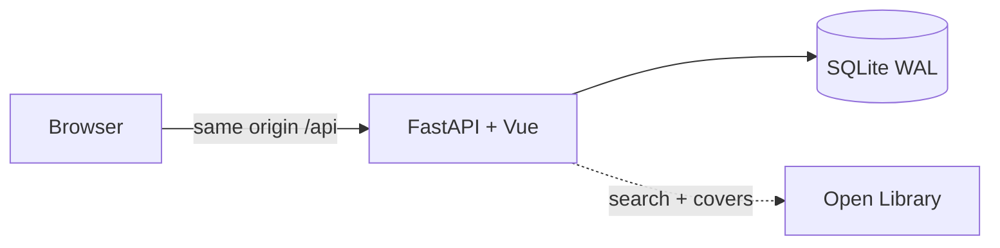

<div align="center">

# Bookclub

[](https://github.com/rafiistcool/bookclub/releases/latest)
[](https://github.com/rafiistcool/bookclub/pkgs/container/bookclub)
[](https://github.com/rafiistcool/bookclub/actions/workflows/ci.yml)

**A private book club for 2–5 people.** Invite-only shelves, one shared pick, and a spoiler-shielded diary — one container, one SQLite file.

You host it. There is no public service. One named club per instance.

</div>

- **Shelves** — Want to read → Reading → Finished / Did not finish. Drag on desktop; filter grid on a phone.
- **Club pick** — Home is the current book: meeting countdown, everyone’s progress, and a next-up vote.
- **Diary** — Short notes at a reading position (“at 45%”, “Finished ★★★★☆”). Spoiler-shielded for members who are behind; one level of replies and emoji reactions.
- **Discover** — Search [Open Library](https://openlibrary.org) by title, author, or ISBN. Trending row, subject shelves, and **add your own** when the catalog misses.
- **Looks** — Four palettes (Paper, Slate, Forest, Ink) in light / dark / system, per member.
- **Push** — Web Push for meetings, a new pick, and diary notes.
- **One box** — FastAPI + the Vue app in a single image. SQLite WAL. No Redis, no Postgres. amd64 and arm64.

---

## Self-host

Releases ship as `ghcr.io/rafiistcool/bookclub` (amd64 + arm64). No clone needed:

```bash
mkdir bookclub && cd bookclub
curl -fsSLO https://raw.githubusercontent.com/rafiistcool/bookclub/main/docker-compose.yml
curl -fsSL  https://raw.githubusercontent.com/rafiistcool/bookclub/main/.env.example -o .env
# set BOOKCLUB_NAME
# leave SECRET_KEY and BOOKCLUB_BOOTSTRAP_INVITE empty to generate them under ./data
docker compose up -d
docker compose logs -f bookclub
```

Open `http://<host>:8000`. Register with the first-run invite (printed once in the logs, and written to `data/.bootstrap_invite`), then mint more from **Settings → Invites**.

`DEBUG=0` is the Compose default, so `/api/docs` stays closed. Update with `docker compose pull && docker compose up -d`. Pin `:0.4` or `:0.4.0` instead of `:latest` if you want upgrades on your schedule.

Put your own reverse proxy (Caddy, nginx, Tailscale Serve, Cloudflare Tunnel) on the **same host** as the UI, forward `X-Forwarded-Proto`, and leave `BOOKCLUB_HTTPS=auto`. The Vue app calls relative `/api` — there is no split frontend/API origin.

Proxy, LAN, NAS `PUID`/`PGID`, bare metal, backup, systemd, and release tags: **[SELFHOST.md](SELFHOST.md)**.

Building from source (contributors; turns on debug docs and invite `DEV-ONLY` — not for a shared host):

```bash
docker compose -f docker-compose.yml -f docker-compose.dev.yml up --build
```

---

## Develop

Day-to-day work is **two processes**: FastAPI on `:8000` and Vite on `:5173`. Vite proxies `/api` to the backend, so the browser only talks to `localhost:5173`.

Needs Python **3.12+**, Node **20+**, and two terminals. On Homebrew macOS, `python3` may be older than 3.12 — use `python3.12` (or newer) if so.

```bash
cp .env.example .env
# uncomment the local Vite block at the bottom (DEBUG=1, invite DEV-ONLY)
```

Leave `DEBUG=0` if you are using Docker Compose.

**Backend** (leave this running):

```bash
cd backend
python3 -m venv .venv
source .venv/bin/activate          # fish: source .venv/bin/activate.fish
pip install -e ".[dev]"
uvicorn app.main:app --reload --port 8000
```

[http://127.0.0.1:8000/api/health](http://127.0.0.1:8000/api/health) should return `{"ok":true}`. With `DEBUG=1`, docs are at [http://127.0.0.1:8000/api/docs](http://127.0.0.1:8000/api/docs).

**Frontend** (second terminal):

```bash
cd frontend
npm install
npm run dev
```

Open **[http://localhost:5173](http://localhost:5173)** — not port 8000.

**First account.** Create an account with invite `DEV-ONLY` (empty database + `DEBUG=1` only). Username: `a–z`, `0–9`, `_`, 2–32 characters. Password: 8+ characters. After that, `DEV-ONLY` is spent — mint more from **Settings → Invites**, or `cd backend && .venv/bin/python -m app.create_invite`.

| You change | Where it shows up |
|---|---|
| Vue / CSS / TS | Instantly in Vite (`:5173`) |
| Python | Uvicorn `--reload` restarts the API |
| `.env` | Restart uvicorn (settings load at process start) |

**Tests.** Backend, venv active: `pytest`. Frontend: `npm run typecheck`, `npm test`, `npm run build`. CI runs all of those on every push and pull request.

One-process run without Docker (build the Vue app, then serve API + UI from uvicorn):

```bash
cd frontend && npm install && npm run build
cd ../backend && source .venv/bin/activate
uvicorn app.main:app --host 127.0.0.1 --port 8000
```

Open [http://127.0.0.1:8000](http://127.0.0.1:8000). Bind `0.0.0.0` only if the LAN should reach it. For a machine you share, use the [self-host](#self-host) defaults (`DEBUG=0`, generated secrets, HTTPS in front).

---

## How it works



Production is one process: uvicorn serves the API and the built Vue app from `:8000`. Everything lives in **`data/bookclub.db`**. Open Library needs outbound HTTPS and no API key; only books someone adds are stored. A work already in the club database is served from SQLite (local-first). Unknown Open Library works are imported on first open. Club-only books (`/works/BC…`, added from Discover) never call Open Library. Covers come from `covers.openlibrary.org`; blank or invalid IDs fall back to a monogram.

Any member can download `bookclub.db` from **Settings → Backup**, or run `python -m app.backup`. There is no restore-from-upload — replace the files (see [SELFHOST.md](SELFHOST.md)). Schema changes apply on boot.

Invite-only, no email. Any signed-in member can mint invites. Members change their own password under **Settings → Password**; there is no reset link. Treat unused codes like passwords.

| Path | What it is |
|---|---|
| `/` | Club pick, meeting, progress, that book’s diary, next-up vote, past picks |
| `/discover` | Search + browse Open Library; add-your-own when it misses |
| `/shelf` | Your columns (phone: status filter over a cover grid) |
| `/club` | Members, TBR overlap, recent diary across all books, next-up vote |
| `/club/:username` | A member’s shelf and ratings |
| `/book/:workId` | Synopsis, club rating, shelf actions, full diary |
| `/settings` | Theme, invites, Goodreads import, SQLite backup, notifications, password |

Old paths (`/library`, `/friends`, `/overlap`, `/invites`, `/pick`) still redirect.

```
backend/           FastAPI, tests
frontend/          Vue 3 + Vite + Pinia
  public/sw.js     Offline shell, cover cache, Web Push
deploy/            Entrypoint, systemd unit, env example
data/              SQLite (gitignored except .gitkeep)
```

`npm run build` writes into `backend/app/static/` (gitignored). Uvicorn serves that folder in “run” mode.

---

## Configure

Compose and `.env` share the same keys. These are the ones that matter on first start:

| Variable | First-run default | Meaning |
|---|---|---|
| `BOOKCLUB_NAME` | `Bookclub` | Club name in the UI, tab title, manifest, and Open Library User-Agent. |
| `SECRET_KEY` | empty in Compose | Signs the session cookie. Empty + `DEBUG=0` writes `data/.secret_key`. Example / short values are refused when `DEBUG=0`. |
| `BOOKCLUB_BOOTSTRAP_INVITE` | empty in Compose | First invite, only if the DB has none. Empty + `DEBUG=0` writes `data/.bootstrap_invite`. `DEV-ONLY` is refused when `DEBUG=0`. |
| `DEBUG` | `0` in Compose | `1`: CORS for Vite, `/api/docs`. |
| `BOOKCLUB_PUBLIC_URL` | empty | Public origin of this instance (`https://books.example.com`). Same-origin proxy only. |
| `BOOKCLUB_HTTPS` | `auto` | `Secure` cookie only on HTTPS (including `X-Forwarded-Proto`). |
| `BOOKCLUB_TZ` | `UTC` | IANA timezone for meeting labels. |

Theme accents, port, `PUID`/`PGID`, VAPID, trusted proxies, and the rest: **[`.env.example`](.env.example)** and **[SELFHOST.md](SELFHOST.md)**.

---

## API

Cookie session: `bookclub_session` (`credentials: include`). While `DEBUG=1`, the live catalog is at [`/api/docs`](http://127.0.0.1:8000/api/docs). `GET /api/health` is unauthenticated and pings SQLite. Shelf stages: `want_to_read`, `currently_reading`, `finished`, `did_not_finish`.

---

## Troubleshooting

**`DEV-ONLY` is not valid** — someone already registered on this database, or you are on `DEBUG=0` (that code is refused). Mint a new invite (UI, `python -m app.create_invite`, or `data/.bootstrap_invite` on a fresh DB).

**Vite loads but login/search fails** — backend isn’t running on `:8000`. Start uvicorn first. Vite only proxies `/api`. If that port is already taken, stop the leftover process or point Vite’s `server.proxy` at the new one.

**`SECRET_KEY must be a long random string` / `BOOTSTRAP_INVITE cannot be DEV-ONLY`** — `DEBUG=0` refuses demo values. Paste a long random secret, or leave both empty so files are generated under `./data`.

**Logged in on HTTP, not on HTTPS** — the proxy is not forwarding `X-Forwarded-Proto`, or you set `BOOKCLUB_HTTPS=1` on plain HTTP. Leave `BOOKCLUB_HTTPS=auto`.

**Forgot every invite / lost a password** — mint from the server: `docker compose exec bookclub python -m app.create_invite`. There is no reset link; a signed-in member can change their password under Settings. On a toy install, delete `data/bookclub.db*` and start again.

**Push never arrives** — needs HTTPS (or `localhost`). On iPhone, add the app to the Home Screen first. Settings → Notifications → *Send a test*. Rotating `VAPID_PRIVATE_KEY` invalidates every device subscription.

Proxy, NAS, backup, Open Library outages, and upgrades: **[SELFHOST.md](SELFHOST.md)**.
